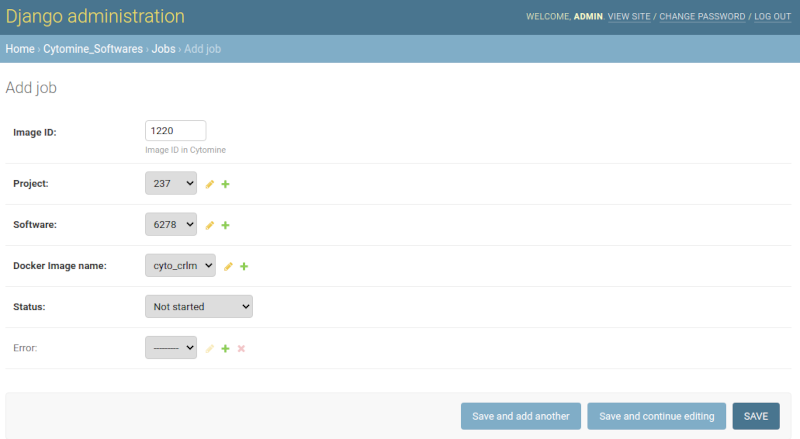

# cytomine_software_manager
Interface to run cytomine software that requires GPU

[Cytomine and cyto_CRLM](https://github.com/QNZhang/cyto_CRLM) are required to use this application so please install
them.


# DEVELOPMENT MODE

## INSTALLATION

1. Clone this repository and go into its directory

   ``` bash
   git clone git@github.com:giussepi/cytomine_software_manager.git
   cd cytomine_software_manager
   ```

2. Create a virtual environment (optional) and activate it (use a directory name different than `.env`)

3. Install requirements

   ``` bash
   pip install -r requirements.txt
   ```
4. Create your `.env` file and fill it properly

	``` bash
	cp env.template .env
	```

## POSTGRESQL DATABASE
You have two options:

1. Install & configure it manually

   1. [Follow these instructions](https://www.postgresql.org/download/linux/ubuntu/)

   2. You can now start the database server using:

	   ``` bash
	   pg_ctlcluster 12 main start
       ```

   3. You can see the logs by running:

		``` bash
		tail -f /var/lib/postgresql/12/main /var/log/postgresql/postgresql-12-main.log
		```

	4. Create your new database, user and pass (the user must be lowercased). Also remember to use the data you wrote on your `.env` file.

	    ``` bash
		sudo -u postgres createdb cyto_soft_mgr_db
		sudo -u postgres pqsl
		create user <db_user> with encrypted password '<db_pass>';
		grant all privileges on database <dn_name> to <db_user>;
		```

2. Build and use our ready-to-use Docker container (recommended)

		``` bash
		cd mypostgres
		docker build -t cyto_postgres .
		docker run --name cyto_soft_mgr-postgres --env-file=settings.env -d -p <port>:<port> cyto_postgres
		```
	     **Note:** The port must match the one defined on your `.env` file.

## SET UP YOUR INITIAL DATABASET
1. Install psycopg2

   [Follow these instructions](https://www.psycopg.org/docs/install.html)

2. Make manage.py executable

   ``` bash
   cd cyto_soft_mgr
   sudo chmod +x manage.py
   ```

3. Run DB migrations

   ``` bash
   ./manage.py migrate
   ```

4. Create your admin super user
   ``` bash
   ./manage.py createsuperuser
   ```

## RabbitMQ & CELERY

1. Install/run RabbitMQ

   ``` bash
   docker run --name cyto_soft_mgr-rabbitmq -d -p <port>:<port> rabbitmq
   ```
   **Note:** The port must match the one defined on your `.env` file.

2. Run the celery worker server (from the same folder where manage.py is located)

   `celery -A cyto_soft_mgr worker -l info`

## DJANGO DEVELOPMENT SERVER

1. Set debug mode in your `.env` file.

	`DJANGO_DEBUG = True`

2. Run django development server and open `localhost:8082/admin` or `127.0.0.1:8082/admin` in your web browser

    `./manage.py runserver 0.0.0.0:8082`


3. The Django development server is reloaded automatically after saving
   changes; however, If you are going to run/test Cytomine jobs, then your must
   manually reload the CELERY process to avoid errors.


## QUICK SETUP :scream: :scream: :scream: (for the lazy!!! :satisfied: :grin: :stuck_out_tongue_winking_eye:)

1. Clone this repository and go into its directory

   ``` bash
   git clone git@github.com:giussepi/cytomine_software_manager.git
   cd cytomine_software_manager
   ```

2. Create your `.env` file and fill it properly

	``` bash
	cp env.template .env
	```
	1. Do not forget to enable debug mode in your `.env` file.

		`DJANGO_DEBUG = True`

3. Make start.sh and stop.sh executable

	``` bash
	sudo chmod +x start.sh
	sudo chmod +x stop.sh
	```

5. Create the images and containers

   Here you have 3 options:

   1. If you do not plan to modify anything then just execute `start.sh`.

   2. If you plan do modify things, you can use the DJANGO_CONTAINER but
      modified a bit. So open the `start.sh` and add the following line right after
	  `docker run --name ${DJANGO_CONTAINER} \`:

	  ``` bash
	  --mount type=bind,source=<your_path>/cytomine_software_manager/,target=/myapp,bind-propagation=private \
	  ```

		1. Now, all your local modifications will be available on the
		container.

		2. Testing any modification will require restarting the
		DJANGO_CONTAINER (it holds Django and CELERY). So to make it easy just
		execute `stop.sh` and then `start.sh`

	3. If you plan to modify things and want to use to Django development server
       locally, then:
 	    1. Open `start.sh` and comment all the code after the line that says
          `--- Django app ---` but the last one.

	    2. Execute `start.sh`

 	    3. Create your virtual environment and install all the requirements
       (steps 2 and 3 of [INSTALLATION](https://github.com/giussepi/cytomine_software_manager#installation)
       section.

		4. Install psycopg2 (see step 1 from [SET UP YOUR INITIAL
              DATASET](https://github.com/giussepi/cytomine_software_manager#set-up-your-initial-databaset))

		5. Make `manage.py` executable (see step 2 from [SET UP YOUR INITIAL
              DATASET](https://github.com/giussepi/cytomine_software_manager#set-up-your-initial-databaset))

		6. Run celery (see step 2 from [RabbitMQ &
              CELERY](https://github.com/giussepi/cytomine_software_manager#rabbitmq--celery)
              section)

		7. Finally just run the Django development server
			``` bash
			./manage.py runserver 0.0.0.0:8082
			```
		8. Remember to restart celery before testing your changes that implies
           running Cytomine jobs.

 	    9. Do not forget to run `stop.sh` and stop Celery after finishing
           working on your tweaks.


6. Open `localhost:8082/admin` or `127.0.0.1:8082/admin` in your web browser.

7. Stopping all the containers is simple, just execute:

	``` bash
	./stop.sh
	```

# PRODUCTION MODE (not completed yet! :bowtie:)

1. Clone this repository and go into its directory

   ``` bash
   git clone git@github.com:giussepi/cytomine_software_manager.git
   cd cytomine_software_manager
   ```

2. Create your `.env` file and fill it properly

	``` bash
	cp env.template .env
	```
	1. Do not forget to disable debug mode in your `.env` file.

	`DJANGO_DEBUG = False`

	2. Do not forget to add your host/domain name to `DJANGO_WEB_HOST`, e.g.:

	```
	DJANGO_WEB_HOST=90.254.58.127
	# or
	DJANGO_WEB_HOST=localhost
	# or
	DJANGO_WEB_HOST=www.mydomain.com
	```

3. Run Django collectstatic command

	`./manage.py collectstatic`


4. Make start.sh and stop.sh executable

	``` bash
	sudo chmod +x start.sh
	sudo chmod +x stop.sh
	```

5. Create the images and containers

	``` bash
	./start.sh
	```

6. Go to your host/admin. e.g.:

	`127.0.0.1:8082/admin`


7. Stop all the containers

	``` bash
	./stop.sh
	```

## HOW TO USE IT

Once you have [Cytomine
Uliege](https://doc.uliege.cytomine.org/display/PubOp/Install+Cytomine+on+Linux),
[cyto_CRLM](https://github.com/QNZhang/cyto_CRLM) and this application working
properly you are ready to start running Cytomine GPU/CPU software. The general
steps are described below:

1. Login in into `127.0.0.0:8082/admin` or into `<your domain>/admin` and add the `cyto_crlm`
   image.

	

2. Add a new job
   1. Copy the image ID you want to analyse. This ID is the number right next to
       `image` in the image URL at Cytomine. e.g.: from
       `http://localhost-core/#/project/237/image/1220/slice/1221?`the image ID
       is 1220.

   2. Add or select the ID of the project which contains the image your want to
      analyse. This ID is the number right next to
      `project` in the project URL at Cytomine. e.g.: from
      `http://localhost-core/#/project/237/images` the project ID is 237.

   3. Add or select the software ID you want to execute. This Id is the number
      right next to `algorithm` in the algorithm URL. e.g: from
      `http://localhost-core/#/algorithm/6278` the ID is 6278. To find the
	  algorithms list just click on the Algorithms tab and then click over the
      algorithm your are interested on.

	  

	4. Select cyto_crlm as the Docker image name

	5. Click save.

 	    


All the jobs are stored on a
[Celery](https://docs.celeryproject.org/en/latest/index.html) queue and will be
executed in a sequential way. Thus, you can create several jobs and they will be
executed one after another.

The running job is visible on the Cytomine's project analysis page.


All running and queued jobs are shown in the jobs page of the cytomine software
manager.


If there any issue/error it will be referenced in the error field of the
job. Once you know the error ID you can find its details at the Job Errors
section of the cytomine software manager.


# TODO
- [x] Create and start everything from a single script.
- [x] Configure Django static directory
- [x] Find the way to update the cytomine public and private keys
- [x] Find and easy way to change debug to False
- [x] Find the way to restard server and rabbitmq, maybe just using supervisorctl
- [x] Change logging from celery and supervisor to info
- [x] Update Readme and show how to use this application
- [ ] Optimize Dockerfile
- [ ] Include collectstatic as one of the container tasks
- [ ] Use nginx to serve static media
- [ ] Run django app (from the container) through WSGI
- [ ] Find and easy way to set log levels
- [ ] Fix the logging
